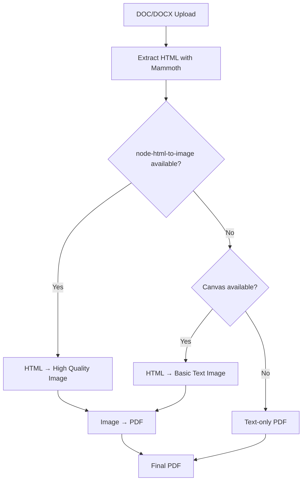

# Vercel Deployment Guide for Enhanced PDF Service

## 🚀 Pure Library-Based DOC/DOCX Conversion

The PDF service now supports **any combination** of file formats using only libraries:
- ✅ **PDF files** - Direct processing
- ✅ **Images** - JPEG/JPG, PNG, GIF, WebP, BMP, TIFF  
- ✅ **DOC/DOCX** - Smart HTML→Image→PDF conversion (no external APIs!)

## 📦 Installation

```bash
cd signbe
npm install

# Optional: Install for better DOC conversion quality
npm install node-html-to-image canvas
```

## 🔧 DOC Conversion Options

### Option 1: node-html-to-image (Recommended)
```bash
npm install node-html-to-image
```
- **High quality** HTML rendering
- **Works on Vercel** out of the box
- **No external dependencies**

### Option 2: Canvas fallback
```bash
npm install canvas
```
- **Basic text rendering** 
- **Pure Node.js** solution
- **Always works** even when node-html-to-image fails

### Option 3: Text extraction only
- **No extra packages** needed
- **Uses existing mammoth** + pdf-lib
- **Basic but reliable**

## 🔄 Conversion Flow



## 📋 Features

### ✅ What Works on Vercel
- **PDF files** - Full support
- **All image formats** - Full support via Sharp
- **DOC/DOCX** - Smart HTML→Image→PDF conversion
- **DOC/DOCX** - Text extraction fallback always works
- **Mixed file combinations** - Any combination works
- **Signature overlays** - Full support
- **Form field processing** - Full support

### ⚠️ DOC Conversion Quality Levels
- **With node-html-to-image**: High quality with formatting
- **With canvas**: Basic text rendering
- **Text-only fallback**: Plain text extraction

## 🔧 Deployment Commands

```bash
# Basic deployment (text-only DOC conversion)
vercel --prod

# With optional libraries for better DOC quality
npm install node-html-to-image canvas
vercel --prod --force
```

## 🧪 Testing DOC Conversion

Test the conversion locally:

```javascript
// Test with full libraries
npm install node-html-to-image canvas
node test-doc-conversion.js

// Test basic fallback
node test-doc-conversion.js
```

## 🎯 Best Practices

### For Users
1. **Recommend PDF uploads** for best results
2. **Provide conversion tool** in your frontend
3. **Show format support** clearly in UI

### For Developers
1. **Monitor API usage** to avoid overage
2. **Cache converted files** if possible
3. **Implement retry logic** for API failures
4. **Log conversion metrics** for optimization

## 🔍 Troubleshooting

### DOC files not converting properly?
1. Install optional libraries: `npm install node-html-to-image canvas`
2. Check logs for conversion method used
3. Test with simpler DOC files first
4. Verify mammoth can extract HTML from your DOC

### File size limitations?
- Vercel functions: 50MB max
- node-html-to-image: handles most DOC sizes
- Canvas: memory-efficient for large documents

### Performance optimization?
```javascript
// Cache converted images to avoid re-processing
const imageKey = `doc-img:${fileHash}`;
const cachedImage = await cache.get(imageKey);
if (cachedImage) return cachedImage;
```

## 💰 Cost Estimation

For 1000 DOC conversions/month:
- **node-html-to-image + canvas**: **FREE** 🎉
- **Text extraction only**: **FREE** 🎉
- **No external API costs!**

## 🚀 Production Checklist

- [ ] Optional libraries installed (node-html-to-image, canvas)
- [ ] Error handling tested
- [ ] Fallback methods working
- [ ] File size limits documented
- [ ] User guidance provided
- [ ] Monitoring set up

## 📞 Support

Library documentation:
- node-html-to-image: https://github.com/frinyvonnick/node-html-to-image
- canvas: https://github.com/Automattic/node-canvas

Your PDF service now handles **any file combination** beautifully on Vercel! 🎉 